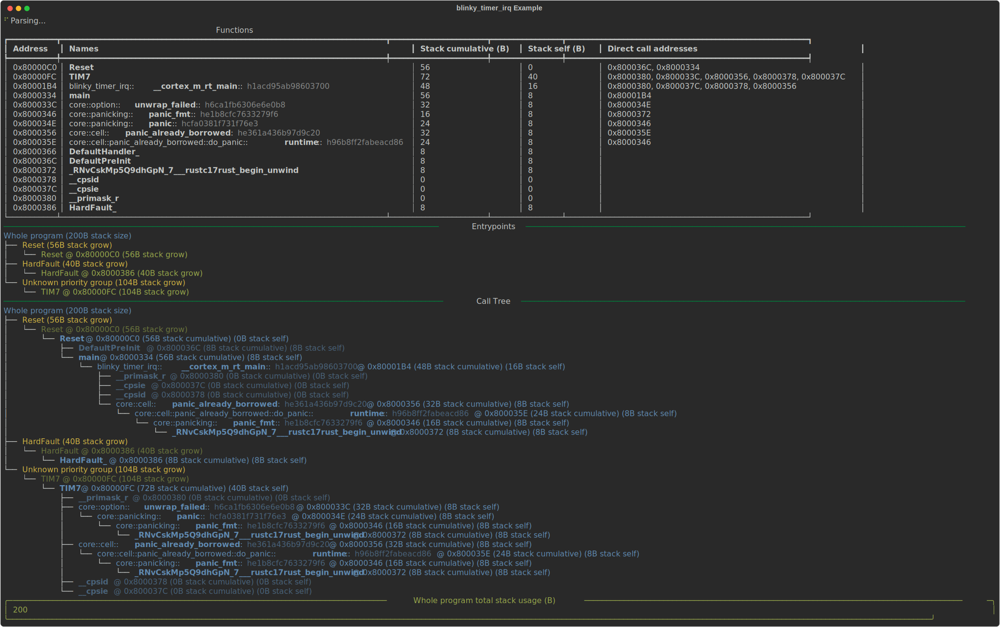

# Stack Depth Analyzer

`stack-depth-analyzer` helps embedded software developers calculate stack usage of their programs so stack and `.data`/`.bss` regions won't collide at runtime and to help prevent stack overflows.

`stack-depth-analyzer` performs a **static** analysis of binaries: it reads the compiled binary, decodes machine-level instructions, computes worst-case stack usage per function, builds a call graph, and analyzes entrypoints to produce a whole-program worst-case stack-usage estimate.

Technically the tool is toolchain- and language-agnostic and requires no instrumentation, but the details matter. See [Features](#features) and [Limitations](#limitations).

### Example

Start by installing the tool (see [Installation](#installation)).

I used https://github.com/stm32-rs/stm32f0xx-hal/tree/master/examples as a reference. Clone that repo and build the examples:

```bash
git clone https://github.com/stm32-rs/stm32f0xx-hal
cd stm32f0xx-hal
cargo build --features="stm32f072 rt" --release --examples
```

Then run `stack-depth-analyzer`, selecting the `elf_arm_thumbv6m_cortex_m0` architecture and the `summary` command on the chosen executable. For example (I used `blinky_timer_irq`):

```bash
stack-depth-analyzer elf_arm_thumbv6m_cortex_m0 summary ./target/thumbv6m-none-eabi/release/examples/blinky_timer_irq
```

Example output (SVG):


### Status

This project began as an internal tool; I later made it public because it can help other embedded developers.

I focused on the Cortex-M0 (Thumbv6-m) + Rust + LLVM use case and consider that scenario feature-complete. The project still needs work to become a universal, multi-target, multi-compiler tool - see [Features](#features) and [Limitations](#limitations).

Contributions are welcome. For larger changes, please open an issue or contact me for a short design discussion first.

## Installation

`stack-depth-analyzer` requires Python 3.13+. Install directly from GitHub with pip:

```bash
# without virtualenv (user install)
pip install --user --upgrade git+https://github.com/peku33/stack-depth-analyzer

# or inside an activated virtualenv
pip install --upgrade git+https://github.com/peku33/stack-depth-analyzer
```

This installs the `stack-depth-analyzer` console script. Make sure your Python scripts directory is on your `$PATH` (on Windows, ensure the equivalent scripts folder is on your PATH).

Verify installation:

```bash
stack-depth-analyzer version
```

## Features

- Analyzes the target executable without instrumentation or external tools.
- Extracts functions by scanning the symbol table, analyzes function code, builds intra-function flow graphs (including some indirect branches such as jump tables), and computes stack usage.
- Extracts entrypoints by scanning the vector table and groups them (with optional hints from the [config](#config)).
- Builds a whole-program call graph and computes a worst-case stack usage (accounting for exception/interrupt stack costs and architecture-specific behavior).
- Prints additional details, including the worst-case path.

## Limitations

- Currently only `thumbv6-m` (Cortex-M0 / M0+) is supported. Extending to `thumbv7-m`/`thumbv8-m` requires work because they are supersets with different instruction/features.
- C/C++ programs often fail due to `__libc_init_array` using runtime-initialized call lists (`__init_array`), which we cannot fully analyze automatically without additional work.
- Some GCC/gnu-toolchain emitted code patterns (observed around `__aeabi_uldivmod`) are harder to resolve compared to LLVM outputs.
- Only basic dynamic-call patterns (e.g., switch/jump tables) are automatically resolved. Hard-to-resolve constructs require manual hints in the config file, such as:
  - C/C++ function pointers
  - C++ virtual method calls
  - Rust trait-object dynamic calls
- Interrupt/exception priorities configured at runtime cannot be inferred automatically - supply hints in the config. The default behavior assumes the worst-case preemption.
- A symbol table is required in the binary. Most toolchains produce one by default, but stripping symbols will prevent analysis.

## Config

Some information cannot be inferred from the binary and requires user input, for example:
- Priority groups for exceptions/interrupts (to determine preemption relationships).
- Dynamic calls where targets cannot be resolved automatically.

The config is a JSON file stored anywhere (project directory is convenient) and passed after the binary path, for example:

```bash
stack-depth-analyzer elf_arm_thumbv6m_cortex_m0 summary ./target/thumbv6m-none-eabi/release/examples/blinky_timer_irq blinky_timer_irq.json
```

Refer to the config specification in [app/elf_arm_thumbv6m_cortex_m0/config.py](app/elf_arm_thumbv6m_cortex_m0/config.py).

A typical config looks like:

```jsonc
{
    "stack_depth_analyzer_version": 1,
    "entrypoints": {
        "default_handler": "DefaultHandler", // or DefaultHandler_, depending on version
        "nmi": false, // NMI is guaranteed not to fire
        "svcall": null, // we don't use SVCall
        "pendsv": null, // we don't use PendSV
        "systick": null, // we don't use SysTick
        "interrupts": [ // TIM3 (#16), USART1 (#27), USART2 (#28), USART3_4 (#29) runs on priority 2, while USB (#31) runs on priority 1.
            {
                "number": 16,
                "name": "TIM3",
                "config": {
                    "priority_group": 2
                }
            },
            {
                "number": 27,
                "name": "USART1",
                "config": {
                    "priority_group": 2
                }
            },
            {
                "number": 28,
                "name": "USART2",
                "config": {
                    "priority_group": 2
                }
            },
            {
                "number": 29,
                "name": "USART3_4",
                "config": {
                    "priority_group": 2
                }
            },
            {
                "number": 31,
                "name": "USB",
                "config": {
                    "priority_group": 1
                }
            }
        ]
    }
}
```

## Architecture Support

- ✅ `thumbv6-m` (Cortex-M0 / M0+) - fully supported.
- ❌ `thumbv7(e)-m` (Cortex-M3/M4) - not yet supported (can be added by extending the implementation).
- ❌ Other architectures (AVR, etc.) - not supported yet.

## Compiler/Toolchain Support

- ✅ Rust - supported (tested with rustc 1.93.0-nightly). Likely works with other recent Rust toolchains.
- ⚠️ GNU ARM Toolchain - partially supported; issues may appear around `__libc_init_array` and some emitted call patterns.
- ⚠️ LLVM Toolchain - partially supported; issues may appear around `__libc_init_array`.
